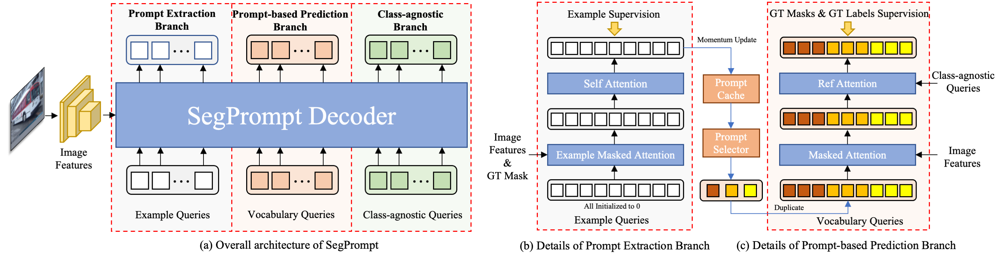

<div align="center">

<h2>SegPrompt: Boosting Open-world Segmentation via Category-level Prompt Learning</h2>

Muzhi Zhu<sup>1</sup>, &nbsp; Hengtao Li <sup>1</sup>, &nbsp; [Hao Chen](https://stan-haochen.github.io/)<sup>1#</sup> , &nbsp;  Chengxiang Fan <sup>1</sup>, &nbsp; [Weian Mao](https://scholar.google.com/citations?user=Qu-QXTsAAAAJ)<sup>2,1</sup>, &nbsp; 
[Chenchen Jing](https://jingchenchen.github.io/)<sup>1</sup>, &nbsp; [Yifan Liu](https://irfanicmll.github.io/)<sup>2</sup>, &nbsp;  [Chunhua Shen](https://cshen.github.io/)<sup>1</sup>

<sup>1</sup>[Zhejiang University](https://github.com/aim-uofa), &nbsp;  <sup>2</sup>[The University of Adelaide](https://www.adelaide.edu.au/), &nbsp; 





</div>

## News

- [2023/07/14] Our work SegPrompt is accepted by Int. Conf. Computer Vision (ICCV) 2023! 🎉🎉🎉
- [2023/08/30] We release our new benchmark LVIS-OW.

## Installation
Please follow the instructions in [Mask2Former](https://github.com/facebookresearch/Mask2Former)

### Other  requirements
```
pip install torchshow
pip install torch-scatter -f https://data.pyg.org/whl/torch-1.10.1+cu113.html
pip install lvis
pip install setuptools==59.5.0
pip install seaborn
```


## LVIS-OW benchmark
Here we provide our proposed new benchmark LVIS-OW. 

### Dataset preparation
First prepare [COCO](https://cocodataset.org/#download) and  [LVIS](https://www.lvisdataset.org/dataset) dataset, place them under $DETECTRON2_DATASETS following [Detectron2](https://github.com/facebookresearch/detectron2/tree/main/datasets)

The dataset structure is as follows:
```
datasets/
  coco/
    annotations/
      instances_{train,val}2017.json
    {train,val}2017/
  lvis/
    lvis_v1_{train,val}.json
```

We reorganize the dataset and divide the categories into Known-Seen-Unseen to better evaluate the open-world model.
The json files can be downloaded from [here](https://drive.google.com/drive/folders/1qNRQbzM4LbNwnQHdIGPgc0iCqiP0GWwO?usp=sharing).

Or you can directly use the command to generate from the json file of COCO and LVIS. 
```
bash tools/prepare_lvisow.sh 
```

After you successfully get lvis_v1_train_ow.json and lvis_v1_val_resplit_r.json, you can refer to [here](https://github.com/facebookresearch/detectron2/blob/main/detectron2/data/datasets/lvis.py)
to register the training set and test set. Then you can use our benchmark for training and testing.

### Evaluation on LVIS-OW
```bash
python tools/eval_lvis_ow.py --dt-json-file output/m2f_binary_lvis_ow/lvis_r/inference/lvis_instances_results.json
```


## Acknowledgement
We thank the following repos for their great works:
- [Mask2Former](https://github.com/facebookresearch/Mask2Former)
- [Detectron2](https://github.com/facebookresearch/detectron2)


## Cite our Paper

If you found this project useful for your paper, please kindly cite our paper.

